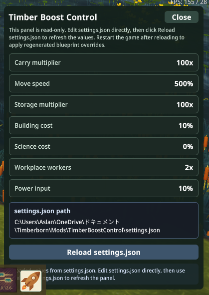
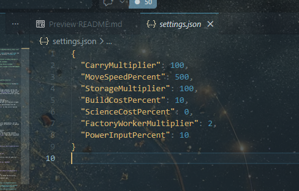

<div align="center">
  
  <h1>TimberBoostControl</h1>
  <p><strong>A Timberborn DLL mod that reloads <code>settings.json</code> and regenerates blueprint boosts from a bottom-bar workflow.</strong></p>
</div>

<p align="center">
  
  
  
  
</p>

<p align="center">
  <a href="./README.md">English</a>
  |
  <a href="./README.ja.md">日本語</a>
</p>

<p align="center">
  <a href="https://sunwood-ai-labs.github.io/TimberBoostControl/">Documentation</a>
  |
  <a href="https://github.com/Sunwood-ai-labs/TimberBoostControl">GitHub</a>
</p>

## 🚀 Overview

TimberBoostControl is a practice Timberborn mod that combines a C# DLL mod with generated `.blueprint.json` overrides. Instead of locking the mod to one hardcoded preset, it reads numeric values from `settings.json`, shows those values in a bottom-bar panel, and regenerates the matching blueprint overrides whenever you reload the file.

## ✨ What It Changes

- Adds a `Boost` launcher to the Timberborn bottom bar.
- Loads and normalizes `settings.json` inside the mod folder.
- Shows the current values and resolved settings path in a read-only in-game panel.
- Regenerates blueprint overrides for characters and buildings from the current JSON values.
- Tracks generated files in `.generated-files.txt` so they can be replaced cleanly on the next pass.

Supported value groups:

- `CarryMultiplier`
- `MoveSpeedPercent`
- `StorageMultiplier`
- `BuildCostPercent`
- `ScienceCostPercent`
- `FactoryWorkerMultiplier`
- `PowerInputPercent`

`FactoryWorkerMultiplier` is still the JSON key for compatibility, but the current UI labels it as `Workplace workers` because the generator now applies the multiplier to general `WorkplaceSpec` entries.

## 🧭 Runtime Flow

1. The mod starts and resolves its working directory.
2. `settings.json` is created if it does not exist.
3. The starter regenerates blueprint overrides from the current settings.
4. During gameplay, open the bottom-bar launcher to inspect the active values.
5. Edit `settings.json`, click `Reload settings.json`, and restart Timberborn to fully apply the regenerated gameplay data.

## 🖼️ Screenshots

### Bottom-bar launcher


### Control panel



### Committed settings.json sample



## 🛠️ Build

Requirements:

- Windows
- Timberborn `1.0.x` installed locally
- `.NET Framework` C# compiler at `C:\Windows\Microsoft.NET\Framework64\v4.0.30319\csc.exe`

Build the DLL:

```powershell
powershell -ExecutionPolicy Bypass -File .\build.ps1
```

If Timberborn is installed in a non-standard location, pass the game root explicitly:

```powershell
powershell -ExecutionPolicy Bypass -File .\build.ps1 -GameRoot "C:\Path\To\Timberborn"
```

## 🎮 Install And Use

1. Build `Code.dll`.
2. Copy this repository into `Documents\Timberborn\Mods\TimberBoostControl`, or create a junction that points there.
3. Enable the mod in Timberborn's Mod Manager.
4. Open the `Boost` launcher from the bottom bar.
5. Edit `settings.json` directly when you want to change the multipliers.
6. Click `Reload settings.json` in the panel.
7. Restart the game to apply the regenerated blueprint data.

## 📚 Documentation

- [Getting Started](https://sunwood-ai-labs.github.io/TimberBoostControl/getting-started)
- [Settings](https://sunwood-ai-labs.github.io/TimberBoostControl/settings)
- [Architecture](https://sunwood-ai-labs.github.io/TimberBoostControl/architecture)
- [Troubleshooting](https://sunwood-ai-labs.github.io/TimberBoostControl/troubleshooting)

## 📁 Repository Layout

- `Source/`: C# sources for the DLL mod
- `Assets/`: runtime UI assets and repository screenshots
- `docs/`: VitePress documentation site
- `scripts/validate-repo.ps1`: structural QA script for repo polish
- `build.ps1`: local build script for `Code.dll`
- `manifest.json`: Timberborn mod manifest
- `settings.json`: persisted settings file loaded by the mod

Generated outputs such as `Buildings/`, `Characters/`, `Code.dll`, and `.generated-files.txt` are intentionally not tracked in git.

## 🧪 Repository QA

After installing the Node dependencies once, you can verify the public-facing surfaces locally:

```powershell
npm install
npm run validate
```

## 📝 Notes

- This repository is meant as a learning example for `IModStarter`, `Configurator`, `ILoadableSingleton`, `UILayout`, and JSON-driven content generation.
- The mod writes override files into its own folder instead of patching gameplay values directly in memory.
- Legacy boolean settings keys are still accepted when older local files are present.
- The committed `settings.json` is currently a showcase sample with stronger values than the built-in code defaults.
- This repository workflow and mod scaffolding were developed with support from [timberborn-modding-skill](https://github.com/Sunwood-ai-labs/timberborn-modding-skill).
